# Codex 额度不够用？这个 5000 Star 的 Skill，帮你“白嫖”ChatGPT 额度

经常用 Codex 的人，大概率都遇到过这个问题：

**任务还没做完，Codex 额度先不够用了。**

但与此同时，你的 ChatGPT 聊天额度可能还躺在那里，根本没怎么用。

这里说的“白嫖”，是把你账号里原本就有、但经常闲置的聊天额度用起来，不是官方提供了无限免费额度。

分享一个很多人都不知道的冷知识：**ChatGPT 的聊天功能和 Codex，用的是两套不同的额度。**

这里说的 ChatGPT 聊天，不只包括浏览器里的 ChatGPT，也包括电脑端 ChatGPT App 里的普通聊天。它们消耗的是 ChatGPT 聊天侧额度；Codex 执行编码任务，则消耗 Codex 自己的额度。

更关键的是，以当前账号界面为例，ChatGPT 聊天端也可以选择能力很强的模型，比如 **GPT-5.6 Sol**。

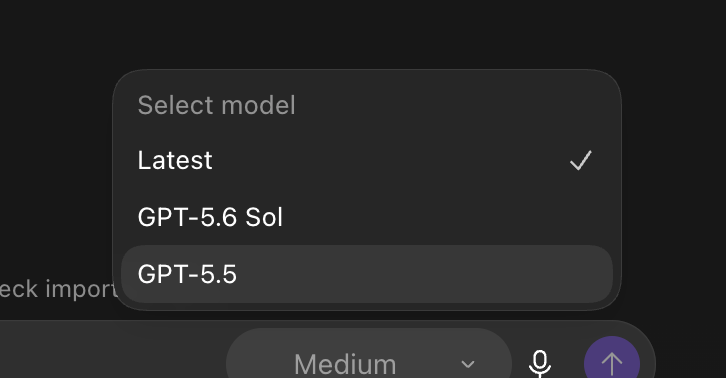

于是一个很自然的想法出现了：

**能不能让 ChatGPT 负责理解需求、做计划和检查结果，把更紧张的 Codex 额度留给真正的文件修改、命令执行和测试？**

## 原来的折中办法，还是要手工搬运

其实，ChatGPT 和 Codex 之间原本已经有一条简单路径。

你可以先在 ChatGPT 里把问题聊清楚，再选择“在快速聊天中打开”，然后把这段内容添加到 Codex。

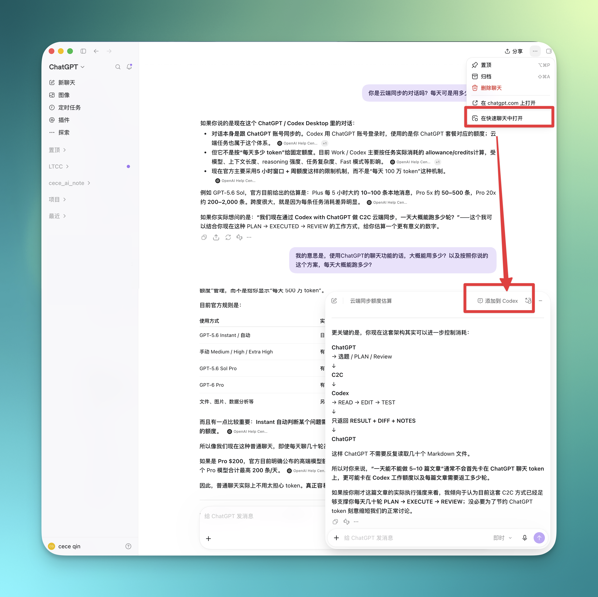

这条路能用，但只适合一次性的交接。

任务一旦进入多轮，你还是要不断搬运：

```text
ChatGPT 做计划
→ 添加到 Codex
→ Codex 执行
→ 把执行结果交回 ChatGPT
→ ChatGPT Review
→ 再交给 Codex 修改
```

多来几轮，人就变成了 ChatGPT 和 Codex 之间的复制粘贴工具。

## 今天分享一个宝藏 Skill：Codex with ChatGPT

这个项目叫 **Codex with ChatGPT**。

它做的事情很直接：

> ChatGPT 负责理解、规划和 Review，Codex 负责真正执行。

项目仓库在 **2026 年 8 月 28 日**创建，首个公开版本在 8 月 30 日发布。截至 **2026 年 9 月 17 日**，公开还不到三周，已经获得 **5,095 Star** 和 **502 Fork**。 而且这个开发人员还是个00后。🤓

这个增长速度，已经足以说明很多人都被同一个问题困扰：**Codex 额度太珍贵，不应该大量消耗在规划和反复 Review 上。**

它的亮点可以概括成四句话：

* **省 Codex 额度**：把规划、分析和复核交给 ChatGPT；
* **ChatGPT 能直接看项目**：不需要你反复复制几十个文件；
* **Codex 仍然掌握执行权**：修改文件、运行命令、测试和 Git 都由 Codex 完成；
* **不需要 API Key**：直接使用你现有 ChatGPT 账户里的聊天额度。

按我现在这种“ChatGPT 规划与复核、Codex 执行”的使用强度，聊天额度大致还能多承担 **40 轮左右的对话/天**。

这里的 40 轮是使用估算，不是官方承诺的固定配额。实际数量会受到账号方案、所选模型、上下文长度和任务复杂度影响。

项目地址直接放在这里：

https://github.com/XiaoDuoYa/codex-with-chatgpt

下面直接安装。

---

> **重要提醒：安装和后续使用时，都要打开 VPN 的 TUN／虚拟网卡模式。**
>
> 每次使用 Codex with ChatGPT 前，都要保持该模式开启，否则可能出现连接超时或功能无法使用的情况。

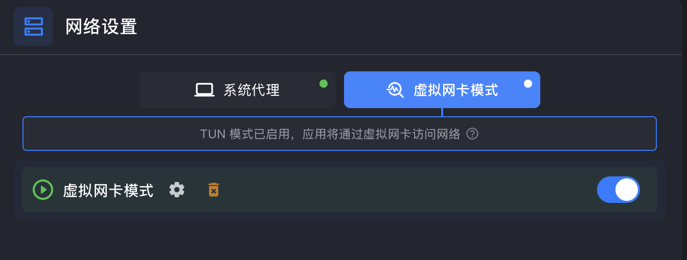

## 安装第一步：提交安装任务并选择连接方式

你不需要先学习 Git、Node.js、MCP 或 OAuth。

打开 Codex，把下面这段提示词完整发给它：

```text
请帮我完整安装并配置 Codex with ChatGPT，全程自动，我是不懂技术的小白，
所有事情你自己做：

1. 环境自检：需要 git 和 Node.js ≥ 20，缺什么就自动安装
  （macOS 用 Homebrew，Windows 用 winget），同时安装 cloudflared。
2. 下载：把 https://github.com/XiaoDuoYa/codex-with-chatgpt 克隆到
   ~/codex-with-chatgpt（已存在就 git pull 更新）。
3. 构建：在该目录里执行 corepack pnpm install 和 corepack pnpm build。
4. 安装 Skill：把仓库里的 skill/SKILL.md 复制到
   ~/.codex/skills/codex-with-chatgpt/SKILL.md，并把文件中
   "The codex-with-chatgpt checkout lives at:" 那一行的路径改成实际克隆路径。
5. 首次配置：按 SKILL.md 里的 first-time setup 流程执行
  （运行 c2c setup，用内置浏览器打开 ChatGPT 配置连接器并输入配对码）。
   全程只用内置浏览器，禁止打开任何第三方浏览器。
6. 只有遇到需要我登录（ChatGPT / Cloudflare）、验证码或两步验证时才叫我，
   而且一次只告诉我一个动作。
7. 完成后给我看 ✓ 清单，并确认文件读取测试通过。我不懂 MCP、OAuth、
   Tunnel、端口这些词，不要向我解释；出了问题先自己修。
```
其中第二段和第四段的保存的位置都可以进行修改。

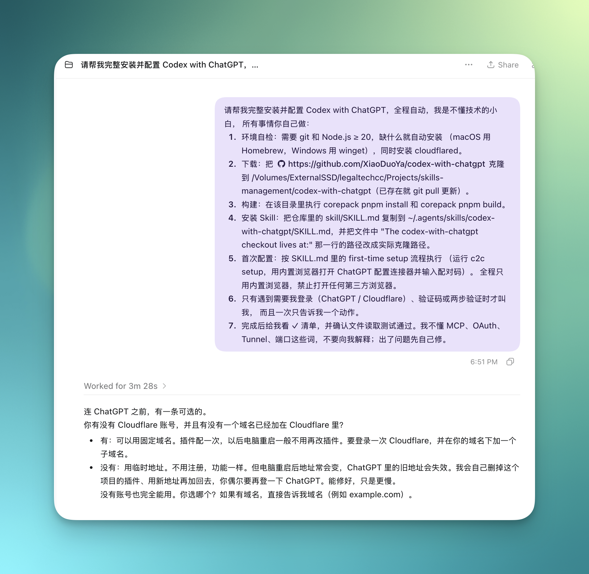

接下来，Codex 会自己检查环境、下载项目、安装依赖和安装 Skill。连接 ChatGPT 前，它还会询问你是否有 Cloudflare 账号，以及是否已有接入 Cloudflare 的域名。

如果你和我一样，已经有账号和域名，直接回复：

```text
有 cece.ee
```

把 `cece.ee` 换成你自己的域名即可。这样配置一次后，电脑重启通常也不需要重新添加插件。

如果没有账号或域名，直接选择：

```text
2
```

使用临时地址不影响核心功能，只是电脑重启后地址可能发生变化，届时按 Codex 的提示重新连接即可。

完成选择后，继续等 Codex 告诉你下一步。

## 安装第二步：选择手动教学配置

第一次连接 ChatGPT 时，Codex 会让你选择：

1. AI 自动化配置；
2. 手动教学配置。

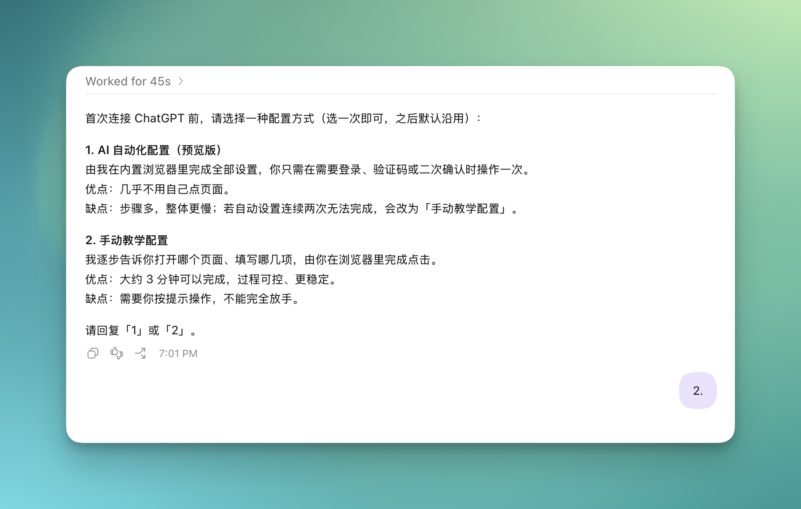

两种安装方式我都试了，相对来讲第一种时间会比较长，因为需要使用内置浏览器，排查问题不太容易，第一次安装建议直接回复：

```text
2
```

手动教学并不意味着你要自己研究配置。Codex 会一次只告诉你一个动作，过程更直观，也更容易发现卡在哪一步。

## 安装第三步：打开开发者模式

接下来，Codex 会打开 ChatGPT，并提示你进入设置，开启“开发人员模式”。

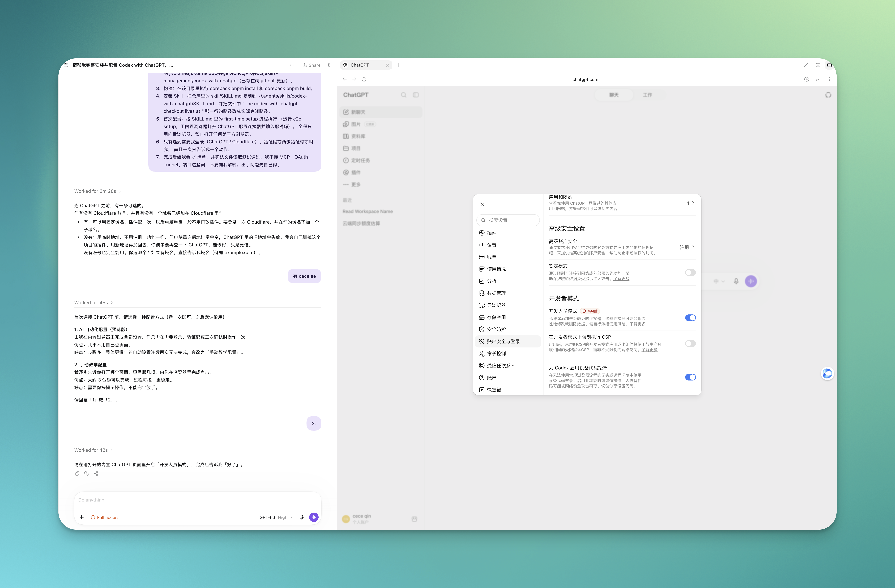

按截图打开后，回到 Codex 回复：

```text
好了
```

不同账号看到的设置名称可能略有差异。跟着 Codex 当前给出的页面和提示操作即可。

## 安装第四步：创建插件

然后，Codex 会让你进入 ChatGPT 的插件页面，新建一个插件。

名称、描述、服务器地址和验证方式，Codex 都会直接给你。你只需要照着填写。

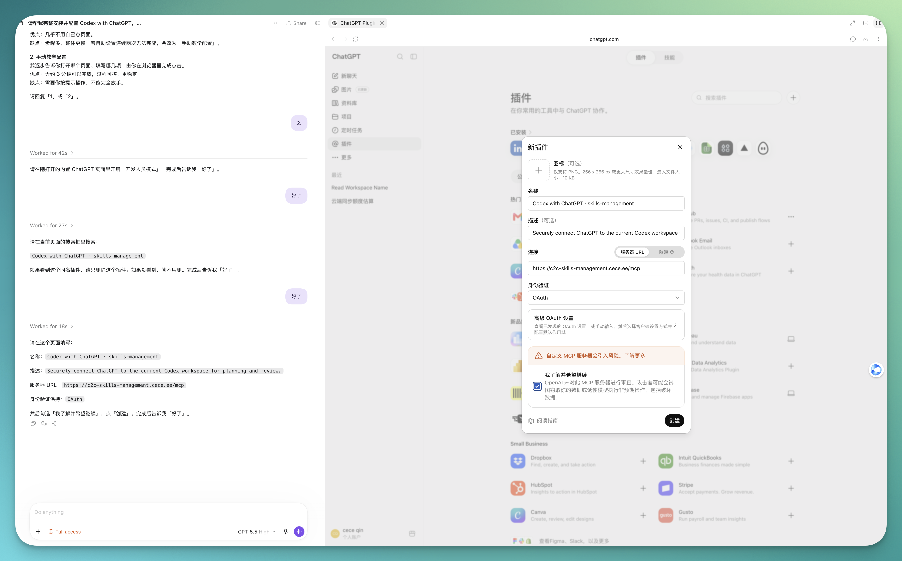

这里注意三点：

* 服务器 URL 直接复制 Codex 给出的地址，不要自行修改；
* 身份验证选择 `OAuth`；
* 确认这是你刚刚发起的连接后，再勾选风险提示并创建。

创建完成后回复：

```text
好了
```

## 安装第五步：创建对应的 ChatGPT Project

插件创建完成后，Codex 会让你在 ChatGPT 里新建一个 Project。

项目名称使用当前本地工作区的名称，记忆范围选择“仅限项目记忆”。

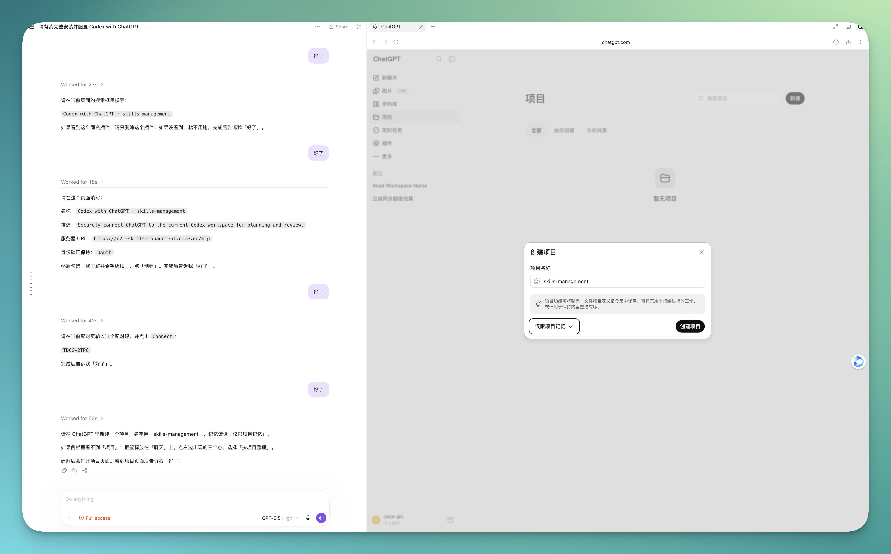

这样做的作用很简单：让 ChatGPT 知道这个 Project 对应的是哪个本地文件夹，避免不同项目之间串线。

创建并打开项目后回复：

```text
好了
```

## 安装第六步：输入配对码

最后，Codex 会给出一个一次性配对码。

在当前 ChatGPT 对话里输入配对码，点击连接，然后告诉 Codex 已经完成。

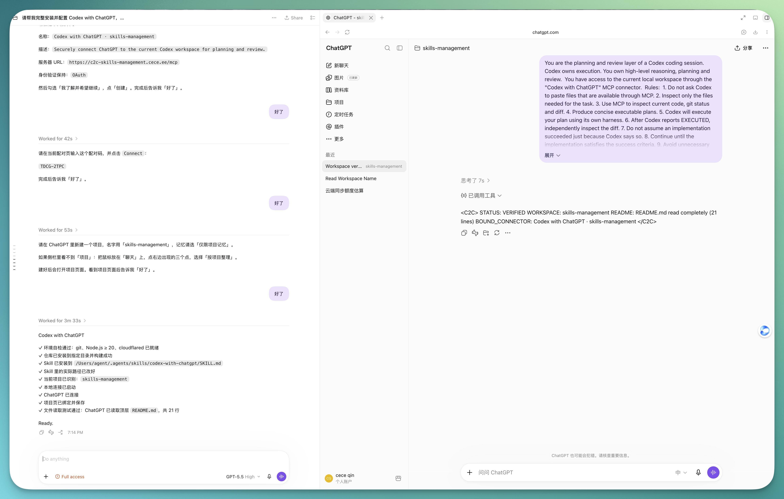

回复：

```text
好了
```

正常情况下，Codex 随后会给出类似这样的检查结果：

```text
Codex with ChatGPT

✓ 当前项目已识别
✓ 安全连接已建立
✓ ChatGPT 已连接
✓ 文件读取测试通过

Ready.
```

看到 `Ready`，安装就完成了。

---

## 安装完成后，直接这样使用

之后不需要再走一遍安装流程。

在 Codex 里直接说：

```text
[写入你的真实需求]

使用 Codex with ChatGPT，为这个项目制定实现计划，然后由 Codex 执行，最后让 ChatGPT 检查实际改动和测试结果。
```

同一个项目文件夹，即使新开 Codex 对话也可以继续使用。换到另一个项目文件夹时，通常只需要重新建立这个文件夹与 ChatGPT Project 的连接，不需要重装整套环境。

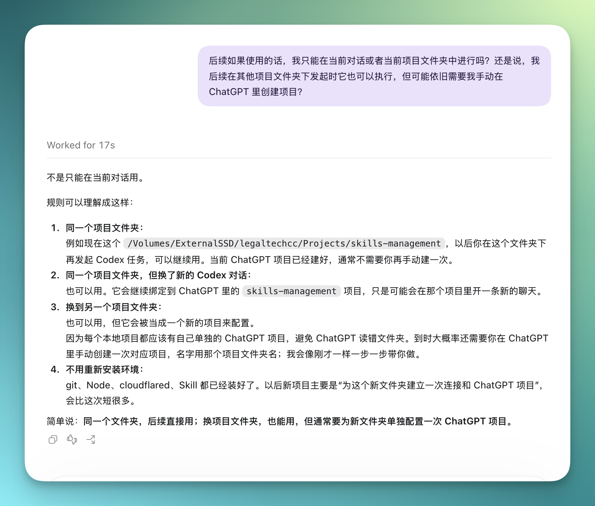

## 实际使用效果

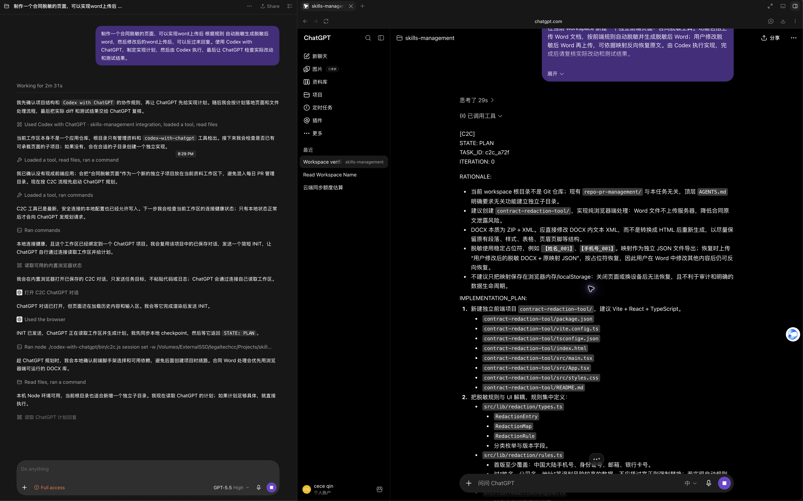

实际运行时，页面右侧会自动唤起 ChatGPT 对话，让它读取当前项目并制定实现计划。

左侧的 Codex 会持续监控协作进程。收到 ChatGPT 返回的计划后，Codex 开始修改文件、运行命令和测试；执行完成后，再把实际改动和测试结果交给 ChatGPT 检查。

整个过程形成一个完整循环：

* ChatGPT 先读取当前项目并给出计划；
* Codex 按计划修改文件、运行命令和测试；
* ChatGPT 再查看真实改动，做一次独立 Review；
* 发现问题就进入下一轮，没有问题才结束。

---

## 最后，用一张图看懂原理

前面的安装和使用已经足够完成日常任务。原理只需要记住下面这一张图。

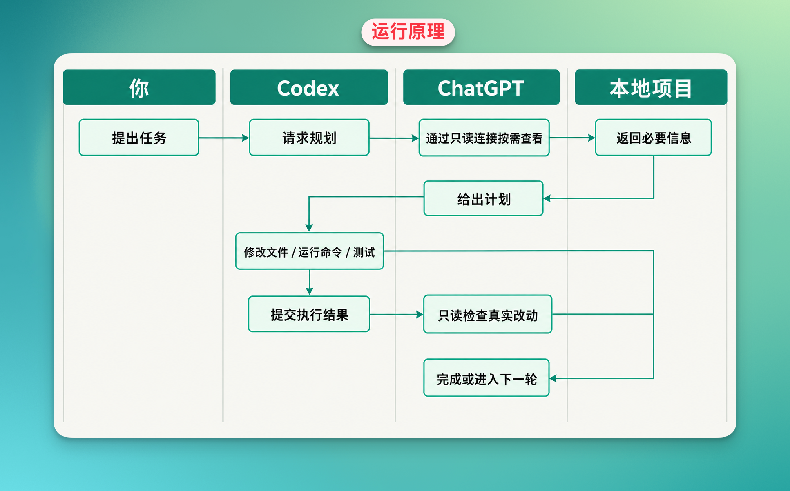

核心分工只有两句：

* **ChatGPT 负责想**：理解需求、规划、分析和 Review；
* **Codex 负责做**：修改本地文件、运行命令、测试和修复。

ChatGPT 通过只读连接查看当前任务需要的信息，不能直接修改你的文件。真正会改变本地项目的，仍然是 Codex。

所以这个 Skill 最有价值的地方，不是增加了一个复杂的新概念，而是解决了一个非常实际的问题：

**让 ChatGPT 的聊天额度承担更多“思考”，把 Codex 额度留给真正的“执行”。**

对于经常把 Codex 用到额度告急的人，这个 5000 Star 的项目确实值得装。

> 数据说明：项目创建时间、Star 和 Fork 数量核验于 2026 年 9 月 17 日；额度轮次为实际使用估算，不是 OpenAI 官方固定配额。
